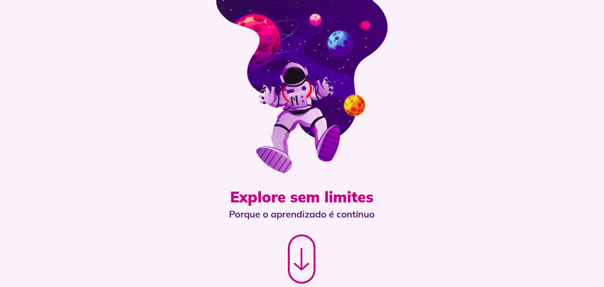

# Explore sem limites
Este projeto é um **layout de landing page com temática de astronauta**, desenvolvido para inspirar os usuários a sempre buscarem conhecimento. Com um design moderno, **totalmente responsivo e repleto de animações envolventes**, a página oferece uma experiência imersiva que remete à exploração do universo - assim como o aprendizado, que nunca tem fim. Cada detalhe foi pensado para transmitir a ideia de inovação e descoberta. Sinta-se à vontade para explorar e contribuir!

## 💻 Layout


## 🔧 Linguagens
 - HTML
 - CSS
 - JS

## 🤖 Clonar repositório

1. Clone o repositório:
```bash
  git clone https://github.com/CaioAlves10/explorer-desafio-explore-sem-limites.git
```

2. Entre no diretório:
```bash
  cd explorer-desafio-explore-sem-limites
```

<br />

---

<br />

<p align="center">
  Feito com 💙 por Caio Carvalho
</p>